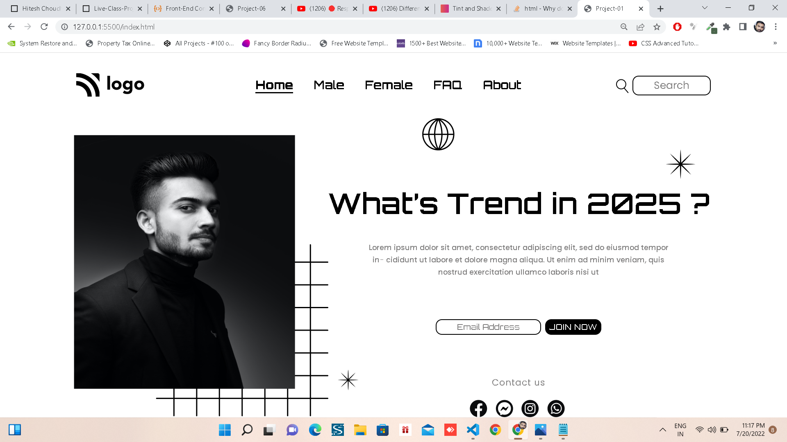

# **Project 01 - Street Style Landing Page**
---
## Name : Aditya Bankar

>This is a honest effort to build my 1st project.In this project, i mainly learnt about positioning and its properties. Being the first project it was time taking, as to how put image on the square grid, how to resize the fonts, images and buttons...
It was great start. Thank you Hitesh sir.

What is learnt from this project:

- About Padding the whole div
- Image Sizing
- Positioning with Relative and Absolute

 

